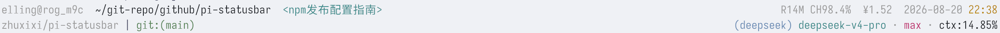

# pi-statusbar

[](https://www.npmjs.com/package/@zhuxixi/pi-statusbar)
[](./LICENSE)
[](https://pi.dev/packages)

A two-line status bar (footer) extension for [pi](https://github.com/earendil-works/pi-coding-agent),
plus an optional third line for extension statuses published via `ctx.ui.setStatus()`
(e.g. pi-mcp-adapter's MCP line).



```text
<user>@<host>  ~/project  <session title>      R6.7M CH99.9% $0.02  2026-08-07 23:25
owner/repo | git:(main)                        (provider) model • effort • ctx:N%
💳 dt $0.01/$199.99   🔌 MCP: 7 servers enabled
```

The third line shows statuses that other extensions publish via
`ctx.ui.setStatus()`. It appears only while at least one extension has
status text, and disappears otherwise — the base layout stays two lines.

## Table of Contents

- [Features](#features)
- [Requirements](#requirements)
- [Installation](#installation)
- [Configuration](#configuration)
- [Development](#development)
- [Troubleshooting](#troubleshooting)
- [Related Documentation](#related-documentation)
- [License](#license)

## Features

- **Line 1**: `user@host` label, current working directory (`$HOME`
  shortened to `~`), session title, prompt-cache stats (`R` reads /
  `W` writes / `CH` latest-request hit rate), accumulated metered API
  cost (`$X.XX` / `¥X.XX`, two decimals, shown only when > 0), live
  clock with minute precision.
- **Line 2**: git remote slug (`owner/repo`, host-agnostic:
  GitHub/GitLab/Gitea/self-hosted/SSH aliases), current branch,
  provider, model, thinking-effort level, and context-usage
  percentage.
- **Line 3 (optional)**: statuses published by other extensions via
  `ctx.ui.setStatus()` — key-sorted, sanitized, truncated to the
  terminal width, ANSI colors preserved. Only rendered while at least
  one extension publishes a status; otherwise the footer stays two
  lines.
- **Adaptive colors**: `ctx:N%` thresholds adapt to the model's
  context window and pi's compaction trigger
  (`contextWindow - reserveTokens`); each thinking level gets its own
  theme color.
- **Zero dependencies beyond pi itself**: pure formatting logic lives
  in `lib/` and is unit-tested without a test framework.

## Requirements

- **pi ≥ 0.84** recommended. The extension defensively falls back on
  older builds: `ctx.thinkingLevel` (a pi 0.84+ property) degrades to
  hiding the thinking-effort field instead of crashing.

## Installation

### From npm (recommended)

```bash
pi install npm:@zhuxixi/pi-statusbar
```

Then run `/reload` in pi (no restart needed).

To update later:

```bash
pi update --extensions
```

To remove:

```bash
pi remove npm:@zhuxixi/pi-statusbar
```

### From source

Clone the repository into a subdirectory of pi's global extensions dir:

```bash
git clone https://github.com/zhuxixi/pi-statusbar.git ~/.pi/agent/extensions/pi-statusbar
```

## Configuration

The `user@host` label is auto-detected from the OS
(`username@hostname`) by default. To set a custom value, run:

```text
/statusbar config
```

This opens a text-input dialog showing the current value in its title.
Type the new label, Enter saves, Esc cancels. The saved value takes
effect immediately and survives `/reload` and restarts.

The footer also shows the session's accumulated API cost when pi
recorded any (pay-per-token providers with prices in pi's built-in
price tables, e.g. DeepSeek). Subscription providers record zero cost
and show nothing. The rule is provider-agnostic: any provider whose
costs pi knows counts automatically.

| Command | Effect |
| ------- | ------ |
| `/statusbar config` | Set a custom `user@host` label |
| `/statusbar config currency` | Pick `usd` (default, pi's native unit) or `cny` |
| `/statusbar config rate` | Set the manual CNY exchange rate (CNY per 1 USD, default `7.2`; not fetched from any API, update it whenever you want) |

The runtime config lives in a single JSON file, created automatically
per machine:

| | |
| --- | --- |
| **Path** | `~/.pi/agent/extensions/pi-statusbar.json` |
| **Format** | `{ "userHost": "alice@workstation", "currency": "cny", "cnyRate": 7.2 }` |
| **Reset** | Delete the file to fall back to defaults |

> **Note**: The config path is the same regardless of how you
> installed the extension (npm or git clone), so both installation
> methods share one configuration. If you edit the file by hand, run
> `/reload` to apply — config is read once at extension load.

## Development

Tests use esbuild to bundle each `test/*.test.ts` and run it with
node — no test framework, no `package.json` required:

```bash
./test/run-all.sh
```

Project layout:

| Path | Purpose |
| ---- | ------- |
| `index.ts` | Extension entry: footer rendering, `/statusbar config` command, session cost accumulation |
| `lib/statusline.ts` | Pure formatting for both footer lines and adaptive colors |
| `lib/remote-slug.ts` | `owner/repo` extraction from any git remote URL (cached per cwd) |
| `lib/cache-stats.ts` | Prompt-cache `R`/`W`/`CH` stats with pi's official semantics |
| `lib/config.ts` | Runtime config read/write and validation |
| `test/` | Dependency-free unit tests run through esbuild |

## Troubleshooting

> **Footer doesn't appear after `/reload`**

Check that the extension is installed: `pi list` should contain
`npm:@zhuxixi/pi-statusbar` (or the clone path under
`~/.pi/agent/extensions/`). If you see it but still no footer, open
pi's message log (`Ctrl+M`) and look for errors mentioning
`pi-statusbar` — older pi builds before 0.84 are the usual cause.

> **The `$X.XX` cost never shows up**

The cost line only appears when pi recorded a non-zero metered cost
for the session. Subscription providers (flat-rate plans) record zero
and show nothing; providers without entries in pi's built-in price
tables also record zero. This is expected behavior, not a bug.

## Related Documentation

- [CHANGELOG](./CHANGELOG.md) — version history and release notes
- [CONTRIBUTING](./CONTRIBUTING.md) — development setup, tests, and commit conventions
- [SECURITY](./SECURITY.md) — how to report a vulnerability

## License

[MIT](./LICENSE)
